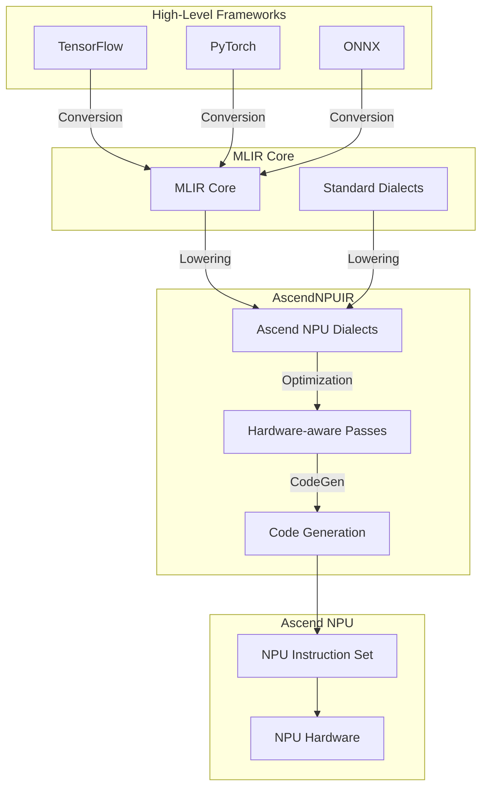

# AscendNPUIR Architecture

This document provides a detailed overview of the AscendNPUIR architecture, including its components, data flow, and key design principles.

## High-Level Architecture

AscendNPUIR is built on top of MLIR and extends it with custom components for Ascend NPU optimization and code generation. The architecture consists of several layers:

## Core Components

### 1. Ascend NPU Dialects

Custom MLIR dialects that model Ascend NPU-specific operations and hardware features:

- **Ascend dialect**: High-level operations representing NPU compute primitives
- **TBE dialect**: Tensor Engine operations for fine-grained control
- **Buffer dialect**: Memory management and buffer operations

### 2. Optimization Passes

Hardware-aware passes that optimize the IR for Ascend NPU architecture:

- **Operator fusion**: Combine multiple operations to reduce memory access
- **Tensor layout optimization**: Optimize data layout for NPU memory hierarchy
- **Parallelism mapping**: Map computations to NPU cores and threads
- **Resource allocation**: Manage NPU resources efficiently

### 3. Code Generation

Translates optimized IR to Ascend NPU instructions:

- **Lowering**: Convert high-level dialects to hardware-specific operations
- **Instruction selection**: Choose optimal NPU instructions for each operation
- **Schedule generation**: Create execution schedules for parallel execution
- **Binary generation**: Produce final NPU binary code

## Data Flow

1. **Import**: Convert models from TensorFlow/PyTorch/ONNX to MLIR
2. **Legalization**: Convert standard MLIR operations to Ascend NPU dialects
3. **Optimization**: Apply hardware-aware passes to improve performance
4. **Lowering**: Translate to low-level NPU operations
5. **CodeGen**: Generate NPU instructions and binary code
6. **Execution**: Run on Ascend NPU hardware

## Design Principles

- **Modularity**: Each component is designed to be independent and extensible
- **Hardware abstraction**: Hide hardware details while exposing optimization opportunities
- **Compatibility**: Maintain compatibility with standard MLIR infrastructure
- **Performance**: Prioritize NPU performance in all design decisions

## Next Steps

- Learn about [Ascend NPU Dialects](./dialects.md)
- Explore [Compiler Passes](./passes.md)
- Follow the [Quick Start Tutorial](./tutorials/quick-start.md)