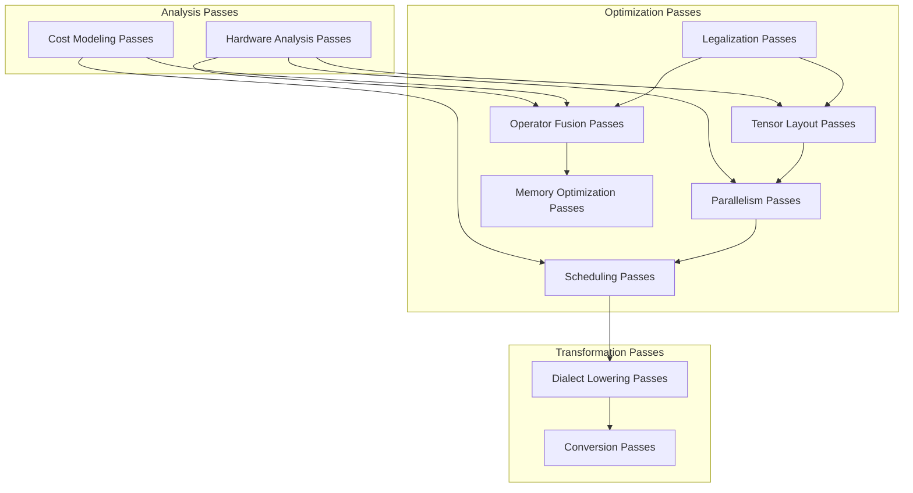

# Compiler Passes

AscendNPUIR provides a suite of hardware-aware optimization passes designed to maximize performance on Ascend NPU hardware. These passes work on the custom Ascend NPU dialects to optimize the intermediate representation for NPU execution.

## Pass Categories



## Core Optimization Passes

### Operator Fusion Passes

Combine multiple operations to reduce memory access and kernel launch overhead.

- **AscendFusionPass**: Fuses compatible Ascend dialect operations
- **TBEOperatorFusionPass**: Fuses low-level Tensor Engine operations
- **PatternMatchingFusionPass**: Uses pattern matching to identify fusion opportunities

**Example Transformation:**
```mlir
// Before fusion
%1 = ascend.relu %0 : tensor<128x64xf32>
%2 = ascend.matmul ins(%1, %b : tensor<128x64xf32>, tensor<64x256xf32>) -> tensor<128x256xf32>

// After fusion
%2 = ascend.fused_relu_matmul ins(%0, %b : tensor<128x64xf32>, tensor<64x256xf32>) -> tensor<128x256xf32>
```

### Tensor Layout Passes

Optimize tensor layouts for the Ascend NPU memory hierarchy and computation engines.

- **LayoutOptimizationPass**: Optimizes tensor layouts based on hardware constraints
- **TensorAlignmentPass**: Ensures tensors are properly aligned for NPU instructions
- **MemorySpaceAssignmentPass**: Assigns tensors to appropriate memory spaces (DDR, HBM, etc.)

### Parallelism Passes

Map computations to NPU cores and threads for maximum parallelism.

- **ParallelMappingPass**: Maps operations to NPU cores
- **ThreadMappingPass**: Maps computations to threads within a core
- **DataParallelismPass**: Implements data parallelism across NPU cores

### Memory Optimization Passes

Optimize memory usage and access patterns.

- **MemoryPoolingPass**: Implements memory pooling to reduce allocation overhead
- **BufferReusePass**: Reuses buffers when possible to reduce memory footprint
- **DataMovementOptimizationPass**: Optimizes data movement between memory hierarchies

### Scheduling Passes

Create efficient execution schedules for parallel execution.

- **StaticSchedulingPass**: Creates static execution schedules
- **DynamicSchedulingPass**: Implements dynamic scheduling for load balancing
- **PipelineSchedulingPass**: Creates pipeline schedules for overlapping execution

## Dialect Lowering Passes

Convert operations between different dialect levels.

- **ConvertLinalgToAscendPass**: Converts Linalg operations to Ascend dialect
- **LowerAscendToTBEPass**: Lowers Ascend dialect to TBE dialect
- **LowerTBEToRuntimePass**: Lowers TBE dialect to Runtime dialect

## Using Passes

### Running Individual Passes

```bash
ascend-opt --ascend-fusion-pass input.mlir -o output.mlir
```

### Running Pass Pipelines

```bash
ascend-opt --ascend-optimization-pipeline input.mlir -o output.mlir
```

### Custom Pass Pipelines

```bash
ascend-opt --convert-linalg-to-ascend --ascend-fusion-pass --layout-optimization-pass --lower-ascend-to-tbe input.mlir -o output.mlir
```

## Pass Development

To create custom passes for AscendNPUIR, see the [Pass Writing](./tutorials/pass-writing.md) tutorial.

## Pass Ordering

The order of passes is critical for optimal results. The recommended pipeline order is:

1. Legalization passes
2. Analysis passes
3. Operator fusion passes
4. Tensor layout passes
5. Parallelism passes
6. Memory optimization passes
7. Scheduling passes
8. Dialect lowering passes